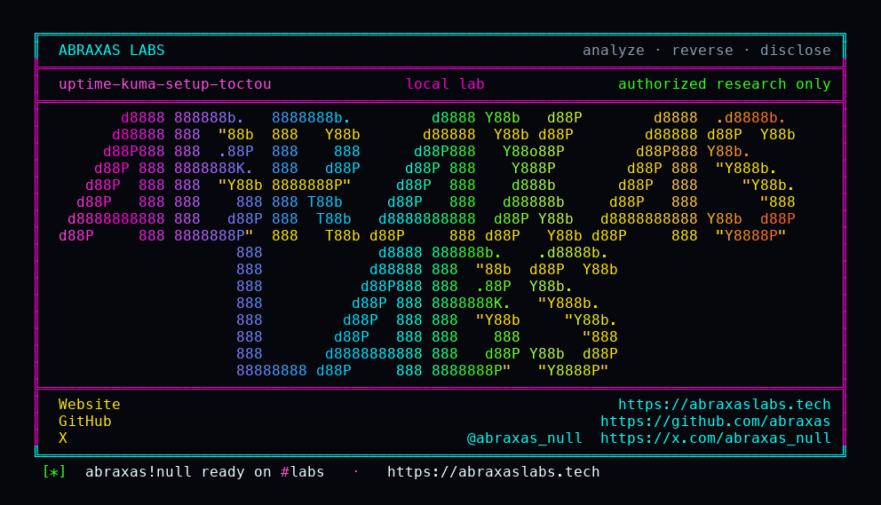

<p align="center">
  
</p>

<p align="center">
  <a href="https://abraxaslabs.tech"><strong>abraxaslabs.tech</strong></a>
  &nbsp;·&nbsp;
  <a href="https://github.com/abraxas">github.com/abraxas</a>
  &nbsp;·&nbsp;
  <a href="https://x.com/abraxas_null">@abraxas_null</a>
  &nbsp;·&nbsp;
  <a href="mailto:abraxas.null@proton.me">abraxas.null@proton.me</a>
  &nbsp;·&nbsp;
  <a href="https://github.com/abraxas/uptime-kuma-setup-toctou">uptime-kuma-setup-toctou</a>
</p>

# uptime-kuma-setup-toctou

**Uptime Kuma** `2.5.5` - Louis Lam

First-run Socket.IO `setup` COUNTs users, bcrypts at cost 10, then INSERTs. Username is UNIQUE only. There is no transaction, mutex, or one-row constraint. Two already-connected sockets that both see `count === 0` both hash, both insert. The extra admin is invisible: there is no user-list UI.

**A stranger who hits a freshly started Kuma in the same poll as the operator can plant a hidden second admin, turn auth off, and ride auto-login onto the operator's monitors.**

| | |
|---|---|
| ID | no CVE yet |
| CWE | [CWE-362](https://cwe.mitre.org/data/definitions/362.html), [CWE-367](https://cwe.mitre.org/data/definitions/367.html) |
| CVSS | **High: 7.4** `CVSS:3.1/AV:N/AC:H/PR:N/UI:N/S:U/C:H/I:H/A:N` |
| Product | [Uptime Kuma](https://github.com/louislam/uptime-kuma) |
| Affected | through **2.5.5** (`c98982a`), first-run empty `user` table |
| Auth | unauthenticated |
| License | [GNU Affero GPL v3.0](LICENSE) |
| Lab | `127.0.0.1` only |

## What an attacker can do

Hit a freshly started Kuma at the same time the operator submits `/setup`. Default Docker bind is `0.0.0.0:3001`. Insert a second `user` row with a different username. Log in as that user, set `disableAuth`, and ride `R.findOne("user")` auto-login onto the operator's monitors, notifications, API keys, and settings.

After the first row commits, a later sequential `setup` is rejected. This is not "setup stays open." It is a race during the bcrypt window. Already-initialized instances with an admin are not this bug.

A latent API-key enable/disable IDOR (`UPDATE api_key SET active=? WHERE id=?` with no `user_id`) also becomes live once two users exist. Follow-on of the extra row, not the lab oracle.

## How I found it

I read [SECURITY.md](https://github.com/louislam/uptime-kuma/blob/2.5.5/SECURITY.md) first, then the skip list: eighteen published GitHub advisories, plus public Matomo `siteId` XSS, plus vendor-wontfix cloud-metadata SSRF. Then twenty-two hunts on tag **2.5.5** (`c98982a`): auth/setup/2FA, socket IDOR, HTTP/monitor SSRF, SSTI leftovers, path/LFI, real-browser, plugin/tailscale, status-page, docker.sock, prototype pollution, push/prometheus, database, monitor exec, analytics XSS, settings, websocket CSRF, frontend XSS, jobs, Apprise, maintenance, master-delta. Most of that bar returned nothing unpublished. Auth did not.

First-user setup is a public Socket.IO event. No login. [`setup`](https://github.com/louislam/uptime-kuma/blob/2.5.5/server/server.js) does `COUNT(user)`, then `await passwordHash.generate`, then `R.store`. [`passwordHash.generate`](https://github.com/louislam/uptime-kuma/blob/2.5.5/server/password-hash.js) is `bcrypt.hash` cost **10**. That is a nap, not a lock. `needSetup` is in-memory and only used to emit `"setup"` on connect. The write path ignores it and re-counts.

The schema is username UNIQUE only. [`knex_init_db.js`](https://github.com/louislam/uptime-kuma/blob/2.5.5/db/knex_init_db.js) does not enforce one row. Same username collides (`SQLITE_CONSTRAINT`). Different usernames both land.

I stood up `louislam/uptime-kuma:2.5.5` on loopback with `UPTIME_KUMA_DB_TYPE=sqlite` so the v2 database wizard is skipped. bcrypt cost 10 is a race, not a guarantee on the first try. `run.sh` wipes the volume and retries. Exit 2 is a miss. Fresh empty `user` table next.

When it hit: sqlite `1|labadmin` and `2|UK-SETUP-TOCTOU-WITNESS`. Sequential late setup: `Uptime Kuma has been initialized`. Extra user logged in, `setSettings` `disableAuth=true`. Reconnect auto-login is `R.findOne("user")`: lowest id, the operator. `prepare2FA` otpauth identity is `labadmin`.

Nearby [GHSA-23q2-5gf8-gjpp](https://github.com/louislam/uptime-kuma/security/advisories/GHSA-23q2-5gf8-gjpp) is disableAuth **re-enable** failing to drop sockets. Different bug.

Wrong turns already recorded: one user row after concurrent setup (race miss, not a patch); `UK-SETUP-TOCTOU-WITNESS` missing because both sockets used the **same** name; treating dashboard HTML 200 as SUCCESS; a reverse shell. Theatre. The oracle is two sqlite rows, then `disableAuth` auto-login as id 1.

## Lab

```bash
cd lab
./run.sh
```

Target **only** `http://127.0.0.1:18141`. Official image `louislam/uptime-kuma:2.5.5`, sqlite, first-run. Do not publish the port off loopback.

```text
user-rows [('1', 'labadmin'), ('2', 'UK-SETUP-TOCTOU-WITNESS')]
race-count=2 witness=True
sequential-late-setup initialized=True
setSettings-disableAuth ack ok
reconnect autoLogin=True loginRequired=False
bonus-autologin-identity operator=True id1=labadmin auto_is_id1=True
SUCCESS uptime-kuma-setup-toctou
```

## The fix

Serialize `setup`: a transaction plus a one-row constraint, or a mutex around COUNT+INSERT. Do not treat `disableAuth` auto-login as `findOne` of the lowest id. Until then, do not expose first-run setup on a shared network.

## References

- [github.com/louislam/uptime-kuma](https://github.com/louislam/uptime-kuma) tag [2.5.5](https://github.com/louislam/uptime-kuma/releases/tag/2.5.5)
- [`server.js` setup](https://github.com/louislam/uptime-kuma/blob/2.5.5/server/server.js) · [`password-hash.js`](https://github.com/louislam/uptime-kuma/blob/2.5.5/server/password-hash.js) · [`knex_init_db.js`](https://github.com/louislam/uptime-kuma/blob/2.5.5/db/knex_init_db.js)
- Nearby, not this bug: [GHSA-23q2-5gf8-gjpp](https://github.com/louislam/uptime-kuma/security/advisories/GHSA-23q2-5gf8-gjpp)
- [CWE-362](https://cwe.mitre.org/data/definitions/362.html) · [CWE-367](https://cwe.mitre.org/data/definitions/367.html)

## License

GNU Affero GPL v3.0. See [LICENSE](LICENSE). Loopback lab only. No warranty.
